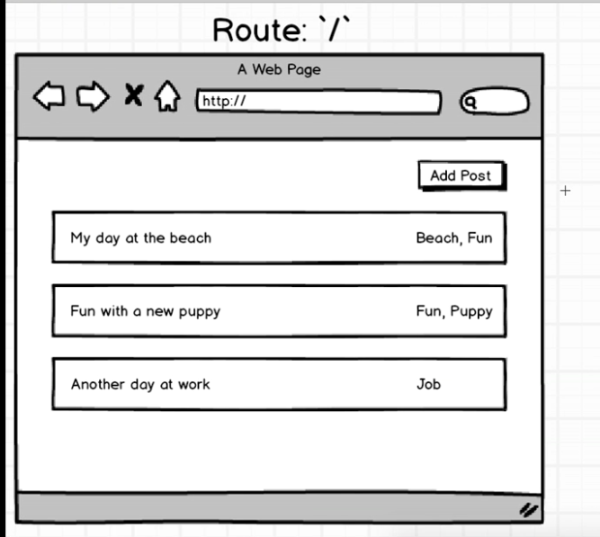
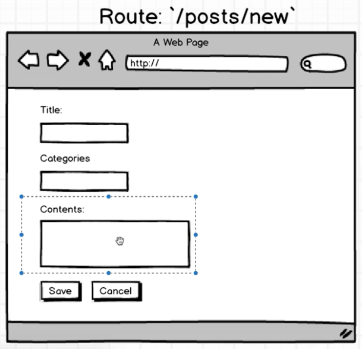
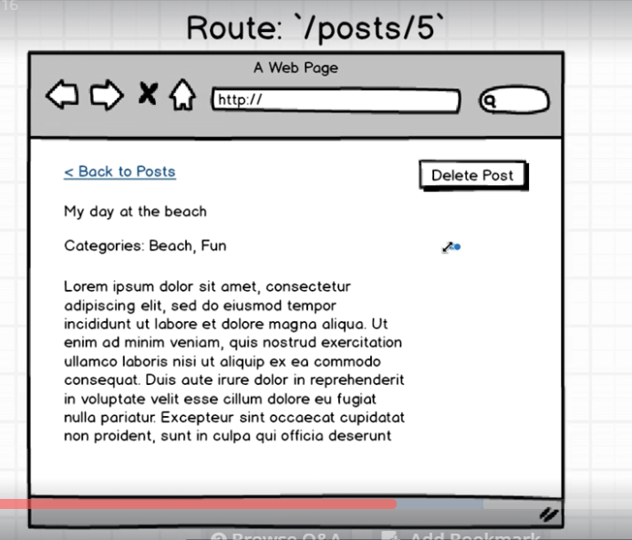

# Redux Blog

### This is a Code-Along To Stephen Grider's [Modern React With Redux](https://www.udemy.com/react-redux/learn/v4/overview). This is the third/last major project code along.

#### A user can view all posts, view more details of a single post, and create a new post. Axios requests to/for saved blog posts and other routes are made on his API at http://reduxblog.herokuapp.com/

### Changes I made:
* None. Purpose was to get experience using redux, understanding actions, action creators, and reducers in a react application

Homepage Route '/' 

User can view titles of existing posts

Show Post Route '/posts/:id'

User can view more details of a single post

New Post Route '/posts/new'

User can create a new post by filling and submitting a form


### Technologies:
* React
* Redux
* redux-form
* react router
* lodash
* axios
* webpack

### Components
* postsIndex (Show posts)
* postsNew (create new post)
* postsShow (show more details of a single post)


### Outline






#### Familiar with Git?
Checkout this repo, install dependencies, then start the gulp process with the following:

```
> git clone https://github.com/yabdabs/react-redux-blog.git
> cd react-redux-blog
> npm install
> npm start
```

